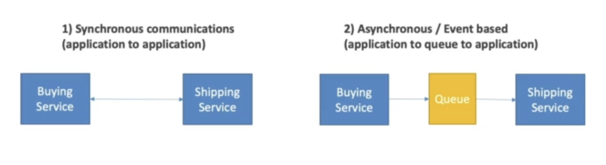
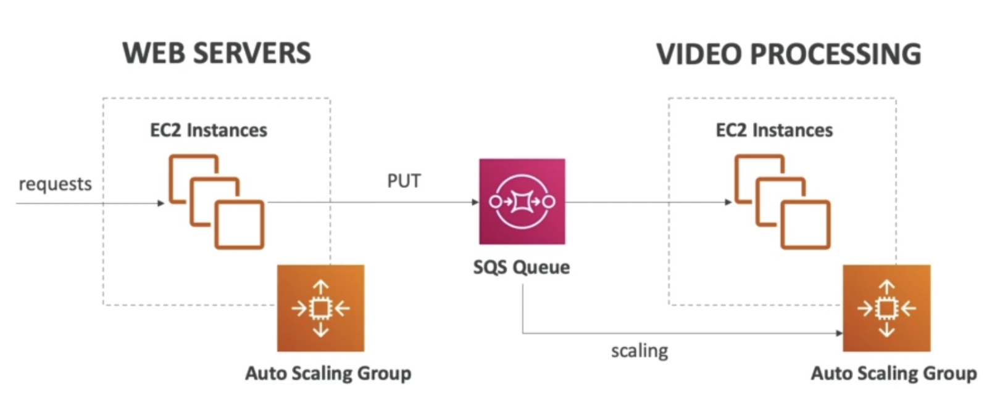
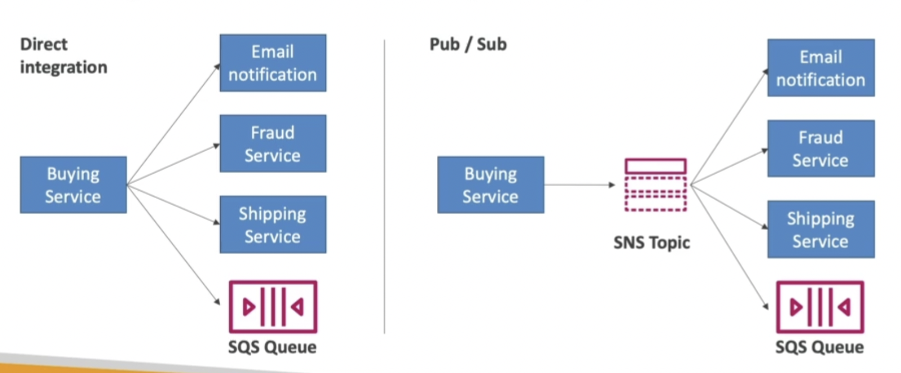

## S11: Cloud Integrations

##### Summary

- SQS
  - Queue service in AWS
  - Multiple producers, messages are kept up to 14 days
  - Multiple consumers ahre the read and delete messages when done
  - Used to decouple applications in AWS
- SNS
  - Notification service in AWS
  - Subscribers: Email, Lambda, SQS, HTTP, Mobile
  - Multiple subscribers, sends messages to all of them
  - No message retention
- Kinesis
  - Real-time data streaming, persistence and analysis
- Amazon MQ
  - Managed Apache MQ in the cloud (MQTT, AMQP)

**Intro**

- Applications need to communicate to each other
- Two Patterns:

Synchronous between applications can be problematic 

- Sudden spikes of traffic
- Better to decouple applications
- Services to Help
  - SQS: Queue model
  - SNS: pub/sub model
  - Kinesis: real-time data streaming model

​	These services can then scale independently from the applications

**Amazon SQS**

- Simple Queue Service
- Producers send messages to the queue
- Consumers read them from the queue and processes them at different speeds
- Serverless, used to decouple applications
- Scales from 1 message per second to 10,000s per second
- Default retention of messages is 4 days, max 14 days
- No limit to # of messages
- Messages are deleted after they're read by consumers
- Low latency (<10 ms on pub and receive)

**Amazon SNS**

- Send one message to many receivers
- Event publishers only sends message to one SNS topic
- As many event subscribers as we want to listen to the SNS topic notifications
- Each subscriber to the topic will get all messages
- 10M subs per topic, 100k topic limit
- Subscribers can be
  - HTTP/HTTPS
  - Emails, SMS, Notifications
  - SQS queues
- Exam: Notifications, subscribers etc.

**Amazon Kinesis**

- Real-time big data streaming
- Managed service to collect, process and analyze real-time streaming data at any scale

**Amazon MQ**

- Managed Apache Active MQ
- Not serverless (so doesn't scale as well) - Runs on a dedicated machine
- When migrating to the cloud, instead of re-engineering application to use SQS and SNS, we can use Amazon MQ
- Has both queue feature and topic features

