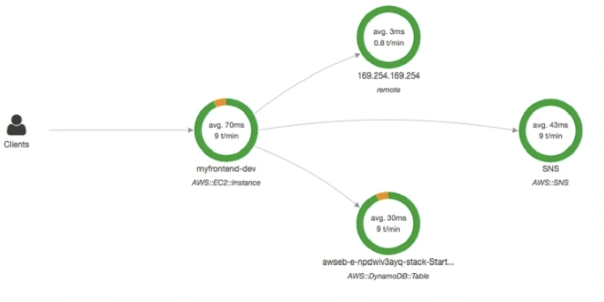

## S12: Cloud Monitoring

##### Summary

- CloudWatch
  - Metrics
    - Monitor the performance of AWS services and billing metrics
  - Alarms
    - automate noticiation, perform EC2 action, notify to SNS based on metric
  - Logs
    - Collect log files from EC2 instances, servers, Lambda functions
  - Events (EventBridge)
    - React to events in AWS or trigger a rule on a schedule
- CloudTrail
  - Audit API calls within AWS account
- CloudTrail Insights
  - Automated analysis of CloudTrail EVents
- X-Ray
  - Trace requests made trhough your distributed applications
- Service Health Dashboard
  - Status of all AWS services across all regions
- Personal Health Dashboard
  - AWS events that impact your infrastructure
- Amazon CodeGuru
  - Automated code reviews and application performance recommendations
  - Reviewer + Profiler

**Intro**

- CloudWatch provides metrics for every service
- Metric
  - Variable to monitor (CPU, Memory...)
  - Have timestamps
- Can create CloudWatch dashboard of metrics

**Important Metrics**

- **EC2**
  - CPU, Status Checks, Network (NO RAM)
  - Every 5 min
  - Ooption for detailed monitoring ($$$); every 1 min
- **EBS**
  - Disk Read/Writes
- **S3 Buckets**
  - BucketSizeBytes, NumberOfObjects, AllRequests
- **Billing**
  - Total estimate charge (only in us-east-1)
- **Service Limits**
  - How much you have been using a service API
- **Custom**
  - Can define your own

**CloudWatch Alarms**

- Trigger notifications for any metric
- Actions
  - Auto Scaling
    - Increase or decrease EC2 instances "desired" count
  - EC2 Actions
    - Stop, terminate, reboot or recover an EC2 instance
  - SNS Notifications
    - Send a notication into an SNS topic
- Various Options (Sampling, %, max, min etc.)
- Can choose the period on which to evaluate alarm
- Alarm States: OK, INSUFFICIENT_DATA, ALARM

**CloudWatch Logs**

- Elastic Beanstalk: collection of logs from application
- ECS: Collection from containers
- Lambda: Collection from functions
- CloudWatch log agents (on EC2 machines or on-premises servers)
  - By default, no logs
  - Need to run CloudWatch agent on EC2 to push log files
  - Make sure IAM permissions are correct
  - Agent can be setup on-premises too

Enables real-time monitoring of logs

Adjustable CloudWatch Logs retention

**CloudWatch Events**

- Schedule: Cron jobs (scheduled scripts)
  - e.g. Schedule every hour, trigger script on Lambda function
- Event Pattern
  - Event rules to react to a service doing something
  - e.g. IAM Root User Sign In Event to SNS Topic with Email Notification

- Trigger Lambda functions, send SNS/SQS messages

**Amazon EventBridge**

- Upgraded CloudWatch Events
- Default Event Bus
  - Generated by AWS services
- Partner event bus
  - Receive events from Saas service or applications (Zendesk, DataDog, Segment, Auth0...)
- Custom Event buses
- Schema Registry
- CW Events name will be replaced with EventBridge

**AWS CloudTrail**

- Provides governance, compliance, and audit for AWS account
- Enabled by default
- Get history of events / API calls made within your AWS account by
  - Console
  - SDK
  - CLI
  - AWS services
- Can put logs from CloudTrail into CloudWatch logs or S3
- A trail can be applied to All Regions (default) or a single Region
- Management Events
  - Operations performed on resources in your AWS account
  - E.g.
    - Configuring security 
    - Configuring rules for routing data
    - Setting up logging

  - By default trails are configured for management events

- Data Events
  - By default, data events are not logged (high volume operations)
  - S3 Objects (can spearate Read and Write)
  - AWS Lambda

- CloudTrail Insights Events
  - Detect unusual activity
    - Inaccurate resource provisioning
    - hitting service limits
    - bursts ofAWS IAM actions
    - gaps in periodic maintenance activity

  - CloudTrail Insights analyzes normal management events to create a baseline
  - Then continuously analyzes write events
    - Anomalies appear in the console and S3 (optional) & EventBridge event is generated

- Events are stored for 90 days; beyond this, log to S3 and use Athena

**AWS X-Ray**

- Debugging in production (old way)
  - Test locally
  - Add log statements everywhere
  - Re-deploy in production
  - Log formats differ across applications and log analysis is hard & Debugging distributed services is tough
- AWS X-Ray gives visual analysis of services

- advantages
  - Troubleshooting performance (bottlenecks)
  - Understand dependencies in microservice architecture
  - Pinpoint service issues
  - Review request behaviour
  - Find errors and exceptions
  - Are we meeting time SLA (Service level agreement)
  - Where I am throttled
  - Identify users that are impacted

**Amazon CodeGuru**

- An ML-Powered service for automated code reviews and application performance recommendations
- 2 functions
  - Reviewer: Automated code review for static code analysis (development)
    - Identify critical issues, security vulnerabilities, and hard-to-find bugs
    - Uses machine learning
    - Trained on open-source
    - Java & Python
    - Integrates with GitHub
  - Profiler: Visibility/recommendations about application perforamnce during runtime (production) (on-premises or cloud)
    - Helps understand runtime behaviour of application
    - Identify and remove code inefficiencies
    - Improve application performance
    - Decrease compute costs
    - Provides heap summary
    - Anomaly Detection
    - Minimal overhead

**AWS Status**

- Service Health Dashboard shows all regions, all services
- Shows historical information
- RSS feed to get notifications

**Personal Health Dashboard**

- AWS Personal Health Dashboard provides alerts and remediation 
  guidance when AWS is experiencing events that may impact you.

- Personalized view into the performance and availability of AWS services underlying your AWS resources
- 
