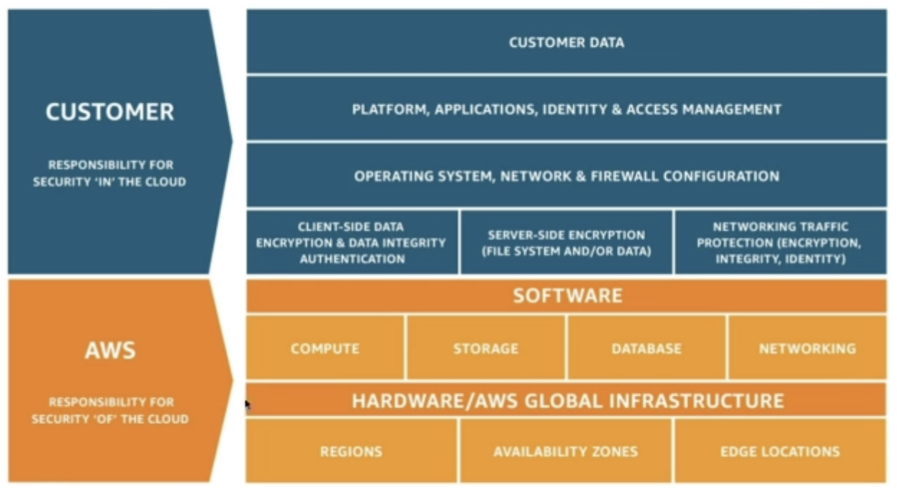

## S14: Security and Compliance

**AWS Shared Responsibility Model**

- AWS Responsibility is Security of the Cloud
  - Protecting infrastructure (hardware, software, facilities, networking)
  - Managed services like S3, DynamoDB, RDS
- Customer Responsibility is Security in the Cloud
  - For EC2 instance, customer is responsible for management of the guest OS (including security patches + updates), firewall & network configuration, IAM
  - Encrypting app data
- Shared Controls
  - Patch Management
  - Configuration Management
  - Awareness & Training

